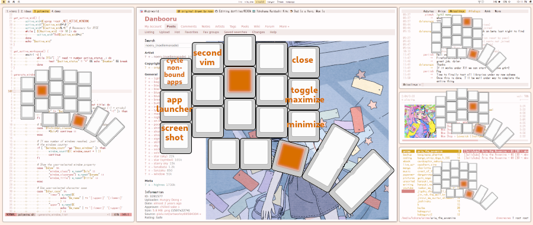

# dotfiles

## Programmatic floating

With [programmatic floating](https://github.com/alnj/dotfiles/blob/master/bin/tamwm), I spend no time positioning windows. Always in the same spots, my eyes always know where to find them. Apps are strictly positioned, never too small or large.

Tiling is more flexible, but wastes time adjusting things by hand when a window is inconveniently positioned. Complex rules can make tiling highly efficient, but programmatic floating can be as simple as making apps open in the right position.

* Apps are launched in a script that positions them.
* Hotkeys can position a window to any preset -- used to "tab" extra apps onto other windows' grid cells.
* When entering a workspace, windows reposition themselves as per that workspace's layout.
  * **Workspace 1:** 80-column Vim (+ line and sign columns), web browser, weechat, ncmpcpp and ranger terminals
  * **Workspace 2:** 2x80-column Vim, web browser
  * **Workspace 3:** 2x80-column Vim, weechat, ncmpcpp and ranger terminals

## Per-application run-or-raise binds.

[Alt-tab is slow.](https://vickychijwani.me/blazing-fast-application-switching-in-linux/) Cardinal window switching, putting apps on dedicated workspaces is slow. 

All often used apps have unique binds that jump to their workspace and focus them. This takes the least keystrokes. If the app is closed, that same bind will run and position it suitably. All frequently used apps are run on startup. Achieved using a slightly modified version of [jumpapp](https://github.com/mkropat/jumpapp).

Image with my run-or-raise binds laid out on my keyboard. You can see how the binds correlate to the windows' position on the screen:

